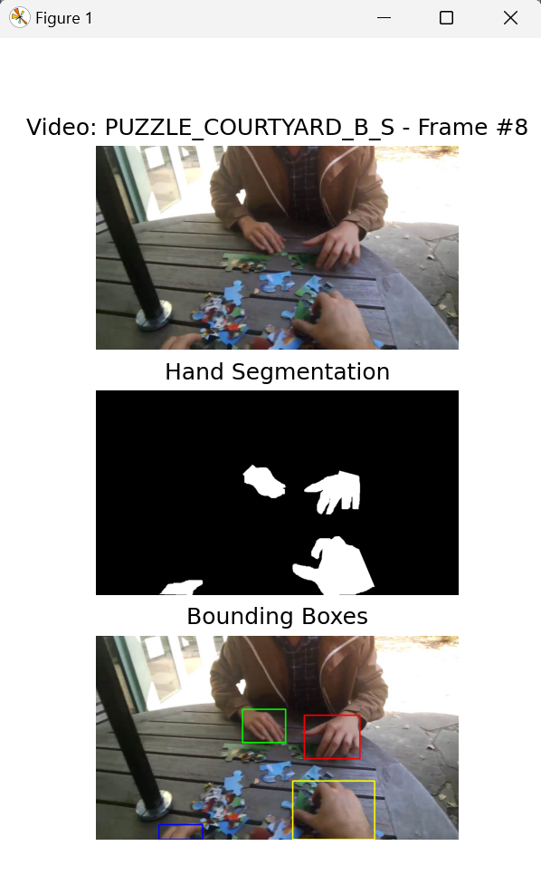
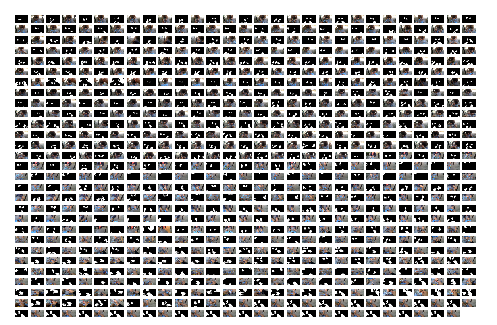

# EgoHands_Dataset

Query over 48 hours of Google Glass video complex first-person interactions from the EgoHands Dataset using filters (location, activity, viewer, partner), and create a PyTorch Database object of respective images and black-and-white hand segmentation labels. All using Python!

<table>
<tr>
<td> <b>Sample Run of DEMO1.py</b>
<td><b>Visualizing Images and Segmentation Labels from Sample PyTorch Dataset Object</b>
</tr>
<tr>
<td>  </td>
<td>  </td>
</tr></table>


In addition, query bounding boxes, segmentations masks, and base images by frame, and filter through videos as stated.

This project makes it easier for developers to run ML models for hand segmentation and adjust their testing set from the EgoHands Dataset.

## Code Overview

Each file contains a description of what it does. 

`getMetaBy.py`, `getSegmentationMask.py`, `getFramePath.py`, `getBoundingBoxes.py`, and `DEMO1.py` contain (for the most part) the same descriptions as from the original EgoHands MATLAB code. The rest (`getTrainingImgs.py`, `visualizeDataset.py`, `dataset.py`) are commented out by myself.

To get a quick overview of what this project can do, run `DEMO1.py` and read the commented out code. To view a sample PyTorch dataset queried from the videos, run `visualizeData.py`. All methods used and referenced include descriptions in the files themeselves.

## Setting Up and Running the Code

### Package Manager and Required Libraries
The following libraries are required for this project. Steps to get set up are below.
- SciPy
- NumPy
- Pandas
- PyTorch
- OpenCV
- Matplotlib
- pathlib

<br>

**Install Anaconda and Creating a New Environment**
<br>
[Install Anaconda](https://www.anaconda.com/) to manage and create a python environment to run this project. 

Next, open up the anaconda prompt and enter the following,
```
conda create -n EgoHandsDataset python=3.9.12
````
```
conda activate EgoHandsDataset
```

<br> 

**Installing SciPy, NumPy, Pandas, OpenCV, Matplotlib, Pathlib, and all Dependencies**
<br>
To install these packages, enter the following in the Anaconda prompt, 
```
conda install pip
```
```
pip install opencv-python
```
```
conda install -c conda-forge scipy numpy pandas matplotlib pathlib
````
<br>

**Installing PyTorch**
<br>
To install PyTorch, visit the [installation guide](https://pytorch.org/get-started/locally/). Scroll down and choose Stable, your OS, Python, and just to run this code you can choose CPU. Of course, decide what is best based on your use case. Run the command it shows in the anaconda prompt.

<br>

**Changing the Interpreter**
<br>
For most IDEs-
In your IDE/Compiler, with your project open, set the interpreter's path to the new environment you just created. To find the path, enter the following in the Anaconda prompt and copy the path with an executable from the EgoHandsDataset environment-

For Mac
```
which python
```

For Windows
```
where python
```

### Downloading the EgoHands frames from Indiana University
Go to [this link](http://vision.soic.indiana.edu/projects/egohands/) and download the "Labelled Data" Zip Archive (which should be around 1.3GB). Unzip this file and drag the \_LABELLEDSAMPLES\_ folder into the same folder where the files of this project are located.

Now, you should be good to go!

<br>

## Maintainer
Contact me here-
- **shivansh.s@utexas.edu**
